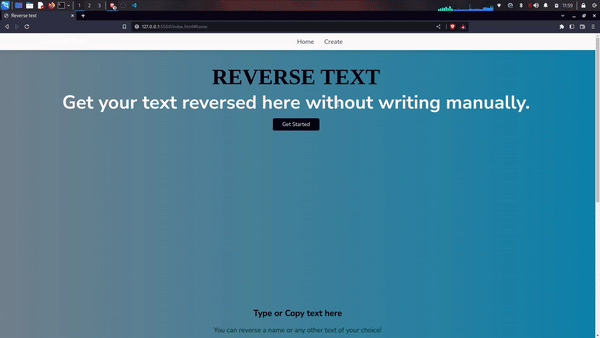
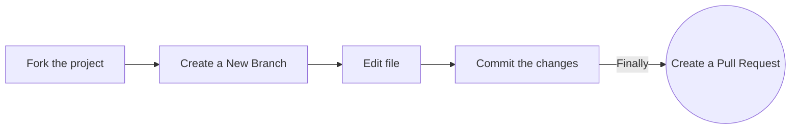

# What is backward-text ?

A website with a textbox where the user needs to enter some text, for eg: a name, fruits name or any text for that matter and when they tap the "Reverse" button the text reverses.

<!--  -->

# Examples

- **Apple** to **elppa**
- **Pear** to **raep**
- **Banana** to **ananab**
- **pseudopodia** to **aidopoduesp**

# Why?

I needed a website to reverse text, instead of reversing text manually for long words (as that would just waste time), I couldn't find anything like this so I made the reverse text website/software.

# Technologies Used

backward-text is built using following technologies

<h3 align="left">Languages and Tools:</h3>

    

# Project Website

[Project Website](https://backward-text.kendalldoescoding.tech)

[Backup URL](https://backward-text.netlify.app)

# Contributing

# Credit
- Original Idea from [roseindia.net](https://www.roseindia.net/javascript/javascriptexamples/javascript-reverse-text-string.shtml)
